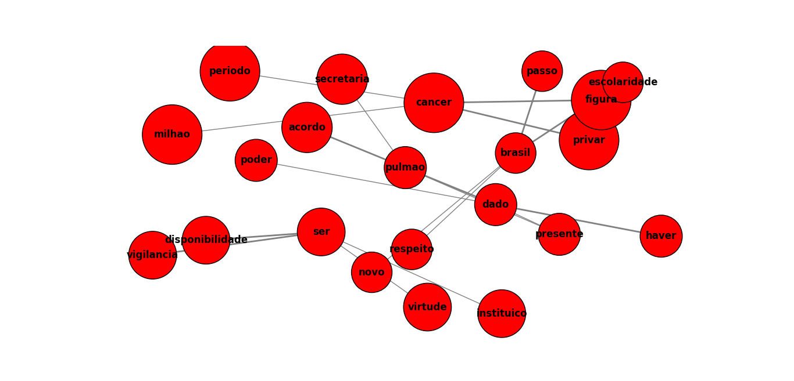

# auto-diagnostic

Esse projeto tem como objetivo desenvolver uma sistema que aplica técnicas de NLP em exames clínicos para ajudar médicos na obtenção de uma visão geral sobre o histórico do paciente e facilitar em tomadas de decisão.

### Pré-requisitos:

- [Python 3.7+](https://www.python.org/downloads/)
- pip
- [Poetry](https://python-poetry.org/)

### Instalação do projeto:

- **Utilizando Poetry**
    + Clonar o projeto
    + Dentro da pasta do projeto executar:
    ```
    poetry install
    ```
- **Utilizando Pip**
    + Clonar o projeto
    + Dentro da pasta do projeto executar:
    ```
    python -m venv .venv
    source .venv/bin/activate
    pip install -e .
    ```

Para conseguir utilizar as dependências do projeto é preciso estar dentro da virtualenv gerada, para isso, se ainda não estiver, execute:

- **Com Poetry**
```
poetry shell
```

- **Sem Poetry**
```
source .venv/bin/activate
```

### CLI

O projeto possui uma CLI que permite gerar o grafo de palavras para um arquivo PDF passado como argumento.

```
auto-diagnostic [-f|--filename FILENAME]
```

**OBS:** No momento, o CLI só funciona para os três documentos PDF que estão em `data/raw/`. Mas futuramente podemos extender para um documento qualquer.

### Resultados

Para os três documentos em `data/raw/`, foi gerado o seguinte grafo de palavras:



### Desenvolvimento

O projeto é estruturado da seguinte forma:

- O diretório `data` contém os arquivos de dados;
    + Os subdiretórios `data/{raw,processed}` serão utilizados para armazenar os dados "crus" e "preprocessados", respectivamente.
- O diretório `notebooks` é onde serão inseridos os arquivos notebook (`.ipynb`) para testes
- O diretório `auto_diagnostic` é o diretório principal do pacote, onde são desenvolvidos os módulos da lib.
